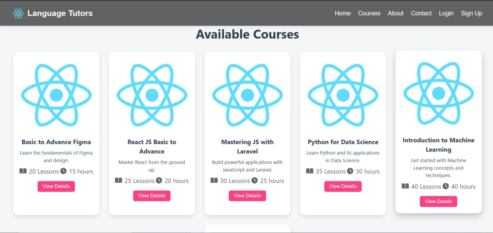
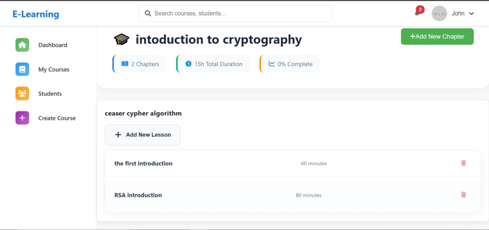
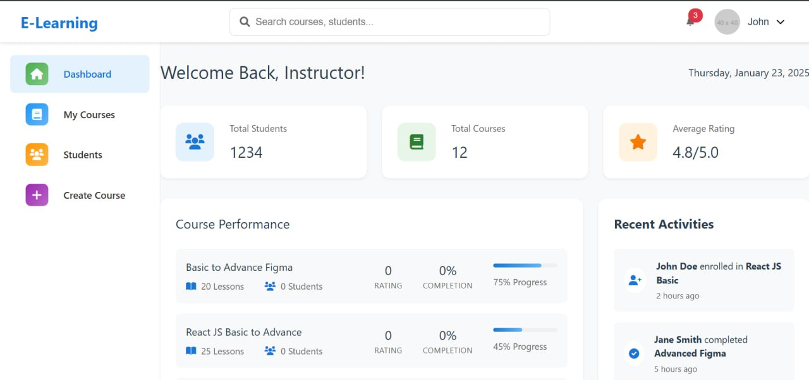
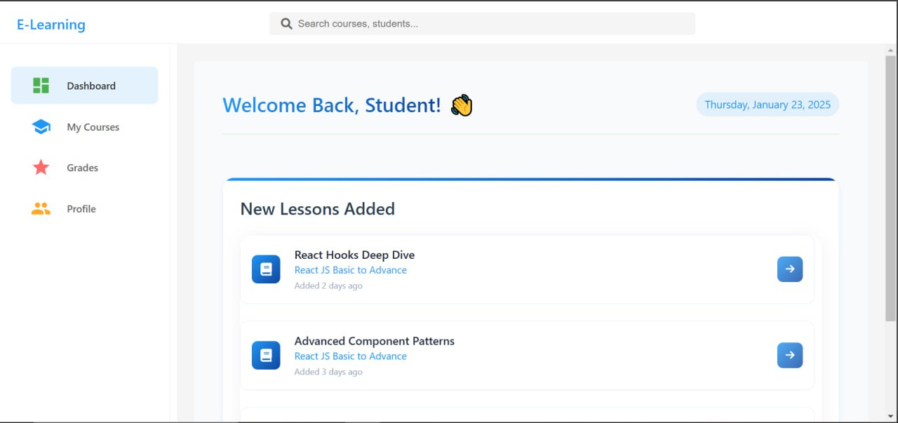

# E-learning-platform

Welcome to the E-learning Platform! This platform provides dashboards for users, teachers, and admins, along with landing pages, contact us page, and other necessary features for a comprehensive e-learning experience.

## Features

- **User Dashboard**: Personalized dashboard for users to track their courses and progress.
- **Teacher Dashboard**: Dashboard for teachers to manage their courses, assignments, and student interactions.
- **Admin Dashboard**: Admin interface to manage users, courses, and platform settings.
- **Landing Pages**: Attractive landing pages to introduce the platform and its features.
- **Contact Us**: A contact page for users to get in touch with the platform's support team.
- **Authentication**: Secure login and registration for users, teachers, and admins.

<div style="display: grid; grid-template-columns: repeat(3, 1fr); gap: 10px;">
  
  
  
  
  
</div>

## Technologies Used

- **JavaScript**: Main programming language for interactive elements.
- **CSS**: Styling for the platform.
- **HTML**: Markup language for structuring the web pages.

## Getting Started

To get started with the project, clone the repository and install the necessary dependencies:

```bash
git clone https://github.com/Malek4522/E-learning-platform.git
cd E-learning-platform
# Install dependencies
